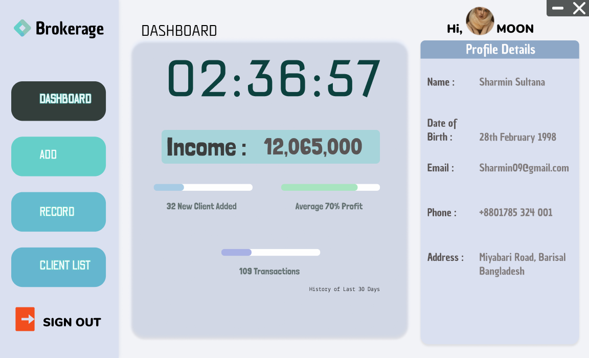

# Broker_Management
 
Where Brokers Can Login , Add Client and Update Informationm.
Records Transaction for Clients.
Generates Profit From Transaction.
Can watch Statistics of Total Clients, Transactions
Can get Transaction and ClientList In DatagridView 
Can get Profit idea from Finance Section. 

Connects to Sql Database File.

**User InterFace**

